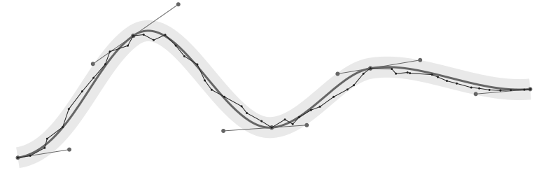

# Python `fitcurves`

A python interface to _An Algorithm for Automatically Fitting Digitized Curves_
by Philip J. Schneider
from _"Graphics Gems"_, Academic Press, 1990.



This implementation uses [the original code](https://github.com/erich666/GraphicsGems/blob/master/gems/FitCurves.c)
with a few modifications to make it usable as a [Python extension](https://docs.python.org/3/extending/extending.html):

- `#define TESTMODE` is commented out
- the `MAX_POINTS` constant has been changed to a parameter
- the `DrawBezierCurve` function takes an additional user-defined parameter and is passed as a function pointer

The user-facing Python interface uses the `complex` type for points:

```py
>>> from fitcurves import fit_curves
>>> points = [0.0+0.0j, 0.0+0.5j, 1.1+1.4j, 2.1+1.6j, 3.2+1.1j, 4.0+0.2j, 4.0+0.0j]
>>> print(fit_curves(points, 1e-3))
[(0j, 0.16666666666666666j, (-0.10297025865531725+0.3689469435295962j), 0.5j), (0.5j, (0.8767144796274305+1.6158184286167296j), (2.020984071769231+1.9687485786963568j), (3.2+1.1j)), ((3.2+1.1j), (4.044290922588672+0.4778908991451889j), (4+0.5469554577577791j), (4+0j))]
```
